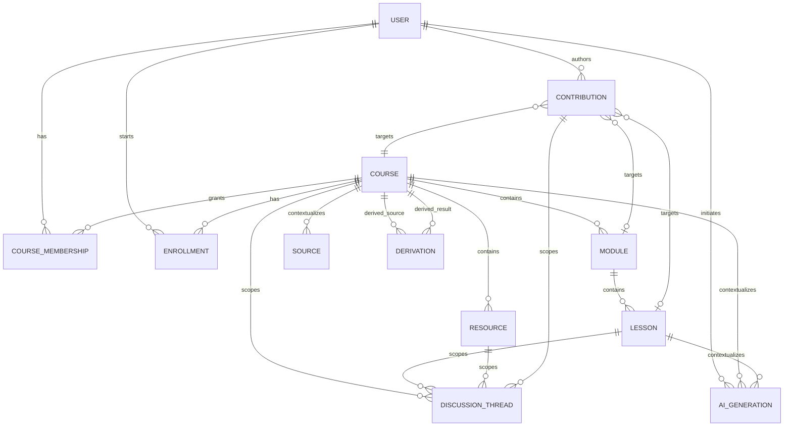

# Sprint 10.U1 - Contextual Roles and Capabilities

## Status and non-goals

This document defines the target authorization model for Forge. It is a design contract for future migrations and RLS work, not an executable migration. In particular, do not change `profiles.role`, existing route guards, course ownership, current RLS policies or production data from this document.

The immediate compatibility constraint is Sprint 10.L3.RLS. Its current helpers protect enrolled-course reads and teacher access to enrolled learner data via `profiles.role`, `enrollments` and `courses.teacher_id`. U2 must introduce new helpers alongside these policies, validate parity, then migrate one table/policy family at a time.

## Recommendation: contextual roles backed by capability sets

Use a hybrid model:

1. **Contextual membership roles** are a small, explainable authorization assignment and collaboration vocabulary.
2. **Capabilities** are the resolved, policy-facing permissions derived from that role, object state and global admin override.
3. **Exceptions** are additive, scoped grants only when a documented workflow needs one. Do not create a boolean column per capability on membership.

This avoids a sprawling boolean schema while avoiding RLS policies that depend on hard-coded role names everywhere. Role defaults can evolve centrally; policy helpers ask a capability question.

### Candidate schema for U2

```text
course_memberships
  id uuid primary key
  course_id uuid -> courses.id
  user_id uuid -> profiles.id
  role course_membership_role
  status membership_status
  invited_by uuid -> profiles.id nullable
  created_at, accepted_at, updated_at
  unique(course_id, user_id)

course_capability_overrides (defer until a real exception exists)
  course_membership_id uuid -> course_memberships.id
  capability course_capability
  effect grant
  granted_by uuid -> profiles.id
  expires_at nullable
  unique(course_membership_id, capability)
```

Recommended initial role values are `viewer`, `learner`, `contributor`, `editor`, and `owner`; membership status is `invited`, `active`, `suspended`, `revoked`. A distinct global `admin` remains in `profiles.role` and is not copied into each membership.

### Capability catalog

```text
view
learn
enroll
comment
propose
reuse
remix
edit
publish
manage_members
```

Use a capability catalog/reference table or a PostgreSQL enum in U2, with role-to-capability mapping held in a stable SQL function or a normalized role-capability table. The choice is implementation-level:

- **Enum + `membership_has_capability()` function** is the smallest robust implementation while roles are product-defined and fixed.
- **Role-capability table** is preferred if product/admin configuration must change mapping without a migration.
- Avoid JSON permission blobs: weak constraints and difficult RLS querying.
- Avoid capability booleans on `course_memberships`: schema churn, ambiguous overrides and error-prone policy expansion.

The RLS entry point should be an explicit `public.has_course_capability(target_course_id, required_capability)` security-definer helper with a fixed empty search path. It resolves active membership, role mapping, any additive valid override and admin bypass. Application code may request a resolved capability set for UX, but RLS never trusts the client result.

## Minimum role matrix

This is the target baseline, not a claim that every capability is immediately implemented.

| Capability | Viewer | Learner | Contributor | Editor | Owner |
| --- | ---: | ---: | ---: | ---: | ---: |
| `can_view` | Yes | Yes | Yes | Yes | Yes |
| `can_learn` | No | Yes | Yes | Yes | Yes |
| `can_enroll` | If course accepts enrollment | N/A | N/A | N/A | N/A |
| `can_comment` | Optional by course policy | Yes | Yes | Yes | Yes |
| `can_propose` | No | Optional | Yes | Yes | Yes |
| `can_reuse` | Subject to source/license policy | Subject to source/license policy | Yes | Yes | Yes |
| `can_remix` | Subject to source/license policy | Subject to source/license policy | Yes | Yes | Yes |
| `can_edit` | No | No | No | Yes | Yes |
| `can_publish` | No | No | No | No by default | Yes |
| `can_manage_members` | No | No | No | No | Yes |

`can_enroll` is chiefly a property of the target course visibility, availability and admission policy, rather than a membership privilege. It appears here to make the decision point explicit. An active membership provides access; a new enrollment does not grant editorial membership.

Global admins may bypass course membership checks for governed operations. This exception must be explicit in helper functions and auditable; it must not require a fake owner membership.

## Enrollment versus membership

| Concept | Purpose | Current / future table | Source of truth |
| --- | --- | --- | --- |
| Membership | General relationship, collaboration and access permissions | Future `course_memberships` | Active membership role and capability resolver |
| Enrollment | Pedagogical participation and lifecycle | Existing `enrollments` | User/course enrollment status, progress and activity |
| Lesson progress | Per-lesson learning state | Existing `lesson_progress` | Learner action/service |
| Notes | Personal learning context | Existing `notes` | Learner-owned content |

Rules:

- A contributor is not implicitly enrolled. They may contribute without learning the Parcours.
- An owner or editor may enroll themselves to track their own progress. That produces one membership and one enrollment with separate meanings.
- A learner needs an enrollment to write progress/notes under the current product model; the future `can_learn` makes this intent explicit.
- Membership never derives progress or completion. Enrollment never grants edit, publish or member management.
- Do not add reciprocal triggers that automatically manufacture one relation from the other. A single explicit service operation may create both only for a defined product flow, and must be idempotent.

### U2.C decision: role-neutral learning access

**Learning access is enrollment-based and role-neutral.** An authenticated active user may read and learn from a Parcours when their own enrollment exists and the Parcours is published, regardless of `profiles.role`. This rule applies to the canonical `/learn` routes, learning Forge context, progress, ready course sources and source-reference journaling.

The public `/learn/[courseSlug]` landing page may offer enrollment only for a published `public` Parcours. A published `unlisted` or `private` Parcours is absent from Explorer; an existing enrollment can still make it available through Mes parcours or a direct canonical link. An enrollment never grants edit, publication, source management or membership management.

The following remain role-based compatibility boundaries: legacy `/app/learner` layouts, Teacher authoring routes and the global Admin role. Existing `teacher_id` ownership and active course memberships continue to decide editorial capabilities.

This preserves a non-contradictory model: permissions come from membership/visibility; pedagogical state comes from enrollment.

## Compatibility inventory

| Existing mechanism | Current dependency | Target migration |
| --- | --- | --- |
| `profiles.role` | Auth profile, role home redirect, app layouts, `requireRole`, navigation, RLS, seed/tests | Keep as compatibility role. Retain `admin` globally; progressively remove `learner`/`teacher` from course-scoped decisions. |
| `courses.teacher_id` | Ownership, course authoring, teacher course/source repositories, RLS helpers | Keep as legacy primary owner and backfill an `owner` membership. Read ownership through capability only after parity validation. |
| `enrollments` | Learner access/progress and teacher student reporting | Preserve as pedagogical state. Future policy combines access capability with enrollment-specific operations. |
| `course_sources.teacher_id` | Teacher-only private source access | Treat as source author/legacy owner. Course-linked source access evolves to `can_edit`/owner plus source scope. |
| `ai_generations` | Separate learner and teacher policies/prompt types | Retain per-user journal. Gate execution by contextual capability and active target rather than identity. |
| `requireRole` and layouts | `/app/learner` and `/app/teacher` shell gates | Preserve until canonical route guards resolve contextual capability. |
| `canManageCourse`/`canPublishCourse` | UI role plus teacher/creator identity checks | Add capability-aware counterparts; migrate call sites per feature rather than changing these globally. |

### `profiles.role` strategy

`profiles.role = admin` remains a global governance role. `learner` and `teacher` remain valid transitional labels and preserve existing onboarding, redirects, routes and policy behavior. They must gradually stop deciding access to a particular Parcours.

The future profile may have product-level eligibility such as `can_create_course`, obtained by verified onboarding, subscription or an admin grant. That is distinct from course membership. Do not treat a membership role as profile identity, and do not let a self-edited profile create entitlement.

## Target RLS policy model

The conceptual policies below use capability names, not final SQL syntax.

| Resource/action | Allow when |
| --- | --- |
| Read a course | Course is published/public or unlisted-link policy allows it, or caller has active `can_view` membership, or caller is global admin. |
| Read modules/lessons/resources | Caller can read parent course and child visibility/access requirements pass. |
| Enroll | Course accepts enrollment and caller has `can_enroll`; insert is only for `auth.uid()`. |
| Read/update own enrollment, progress, notes | Row belongs to `auth.uid()` and target course remains learn-accessible. |
| Read learner progress for a course | Caller has the explicit follow-up/audience capability; initial mapping is owner only. |
| Update course/modules/lessons/resources | Caller has `can_edit`; request preserves ownership/provenance invariants. |
| Create/update/delete course-linked sources | Caller has source-management capability, initially derived from `can_edit`/owner and source scope. |
| Publish | Caller has `can_publish`; server-side validation checks readiness. |
| Manage membership/invitations | Caller has `can_manage_members`; callers cannot grant a role/capability above their delegation ceiling. |
| Create contribution | Caller has `can_propose` on target; author must equal `auth.uid()` and target revision is recorded. |
| Review contribution | Caller has `can_edit` or review capability; acceptance mutation is atomic and auditable. |
| Read/create contextual discussion | Caller has `can_view`/`can_comment` for its target; no loose course-id-only access. |
| Read AI generation metadata/source refs | Caller owns the generation, or has an explicit workflow-specific capability; underlying source access must be rechecked. |

Visibility must not be used as an editing shortcut. `public` answers discovery/read baseline; membership answers access and powers. `private` objects remain available to their authorized members without public discoverability.

### RLS implementation safety

- Use security-definer helpers with `set search_path = ''`, least-privilege grants and a private/internal schema when feasible. The 10.L3 hardened helpers establish the required direction.
- Avoid policy recursion by resolving membership in narrowly scoped helper functions, not through policy queries that re-enter the protected table.
- `course_memberships` must never allow self-insert or self-promotion. Only an owner/admin-controlled invitation/service may create privileged rows; acceptance may change only an invited row for the invited user.
- Enforce a delegation ceiling: editors cannot create owners; owners cannot grant global admin; no one may self-grant a capability.
- Scope profile reads to the minimal fields needed for a member list or discussion. Membership must not open unrelated profiles.
- Recheck parent course capability for child rows and storage objects. A known storage path alone must never grant source access.
- Validate `course_id`, target type/id, provenance parent and source relationships server-side; do not rely on client IDs.
- Record membership, publication, contribution review and capability override changes in an audit trail before exposing broad collaboration.
- Write SQL tests for anonymous, outsider, viewer, learner, contributor, editor, owner and admin, including revoked/pending membership and private/unlisted/public courses.

## Domain model



The present persistent entities are User/Profile, Course, Module, Lesson, Resource, Enrollment, LessonProgress, Note, Source and AI Generation. Membership, Contribution, Derivation and Discussion Thread are target entities; they are intentionally not created in U1.

For a polymorphic target, enforce exactly one valid target relationship in application/service code and database constraints where possible. A generic `target_type`/`target_id` is acceptable for discussion/contribution only if foreign-key integrity is recovered through constrained target tables or separate target columns; unvalidated polymorphism is not sufficient for RLS.

## Route trajectory

The proposed canonical family is:

```text
/app
/app/courses
/app/courses/[courseId]
/app/courses/[courseId]/content
/app/courses/[courseId]/forge
/app/courses/[courseId]/members
/app/courses/[courseId]/contributions
```

It is a destination, not an immediate rename. In U3, `/app/courses` can first be a unified read model linking to existing routes. In U4, object pages may become canonical while legacy `/app/teacher/...` and `/learn/...` routes continue to render or redirect only when authorization, lesson context and browser history remain correct. Public course slugs should remain stable; public read URLs should not be casually changed.

## Phased implementation plan

### U2 - Membership foundation

- Finalize membership roles/statuses and role-capability mapping after schema review.
- Create memberships, indexes, constrained invitation lifecycle, resolver helpers and SQL test fixtures.
- Backfill one active `owner` membership for each non-null `courses.teacher_id` in an idempotent migration.
- Do not remove `teacher_id`, alter existing role policies or migrate UI guards in the same release.
- Add capability resolver tests that establish parity for existing teacher ownership and enrolled learner reads.

### U3 - Navigation and Mes parcours

- Build a server read model that combines memberships, enrollments, ownership backfill and course metadata.
- Introduce intent-first navigation and `Mes parcours` filters while links retain existing route destinations.
- Add feature flags/telemetry for canonical entry adoption and access-denied regressions.

### U4 - Unified workspace

- Create the canonical read-first Parcours workspace.
- Resolve actions from server capabilities; expose explicit edit mode only to `can_edit`.
- Reuse current learner reading, cockpit and builder components behind shared headers, drawers and Forge context.
- Migrate one permission family at a time, starting with course read/edit, while keeping legacy policies as a verified fallback.

### U5 - Collaboration, provenance and contextual communication

- Introduce contribution review, provenance/derivation and target-bound discussion only after membership RLS is stable.
- Add audit events, review permissions and source scope checks before enabling remix or shared sources.

### U6 - Legacy deprecation

- Remove role-specific entry points only when every supported use case has canonical capability coverage and migration telemetry is clean.
- Preserve redirects and stable public URLs; migrate role guards last.

## Acceptance checks for future implementation

- A single active person can own A, learn B, contribute to C and edit D simultaneously.
- The same person can enroll in their owned Parcours without an ownership/progress collision.
- A private Parcours is invisible to outsiders but readable by an invited active viewer.
- An editor can edit but cannot publish or change members by default.
- A contributor can submit a proposal but cannot mutate the original directly.
- A revoked member loses access to child content, sources, storage and discussion targets.
- An existing learner/teacher workflow continues to work while `profiles.role` guards and legacy URLs remain active.
- A Forge request receives only authorized source context and cannot persist an action outside its resolved capability.